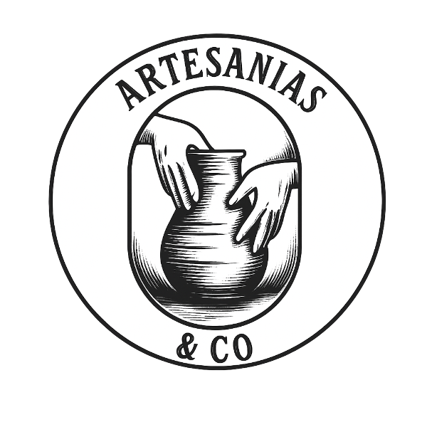

<div align="center">
  
  <h1>Artesanías&Co 🎨</h1>
  <p><strong>Un puente digital entre el corazón del artesano y el tuyo.</strong></p>
  <p>
    <a href="https://github.com/TatsumiDaku/EcommersART/stargazers"></a>
    <a href="https://github.com/TatsumiDaku/EcommersART/network/members"></a>
    <a href="https://github.com/TatsumiDaku/EcommersART/issues"></a>
    <a href="https://github.com/TatsumiDaku/EcommersART/blob/main/LICENSE.md"></a>
  </p>
</div>

---

## ✨ Visión

En un mundo acelerado, las tradiciones y el arte manual corren el riesgo de perderse. **Artesanías&Co** nació para crear un santuario digital donde el legado de los artesanos no solo sobreviva, sino que florezca. Somos una galería viva, un mercado justo y una comunidad que celebra la belleza de lo hecho a mano.

---

## 🚀 Características Principales

- 🛒 **Marketplace auténtico:** Catálogo de productos únicos, cada uno con su historia.
- 👤 **Perfiles de artesano:** Espacios para que los creadores compartan su viaje y taller.
- 💖 **Favoritos:** Guarda las piezas que te enamoran.
- 🛍️ **Carrito de compras:** Experiencia fluida y segura.
- ⭐ **Reseñas y calificaciones:** Confianza a través de la comunidad.
- 🔐 **Panel de administración:** Gestión robusta de productos, usuarios y más.
- 📰 **Blog y noticias:** Eventos, artículos y participación de la comunidad.

---

## 🖥️ Tecnologías

| Área         | Stack                                                                                 |
|--------------|---------------------------------------------------------------------------------------|
| Frontend     | Next.js 14+, React 19, Tailwind CSS, DaisyUI, Axios, React Context, React Hook Form   |
| Backend      | Node.js 18+, Express, JWT, Multer, Nodemailer/Resend, ioredis, ExcelJS, PDFKit       |
| Base de Datos| PostgreSQL 15+                                                                        |
| Infraestructura | Docker, Docker Compose, Nginx, GitHub Actions (CI/CD)                             |

---

## 📁 Estructura del Proyecto

```
ArtesaniasYcoOficial/
├── backend/      # API REST, lógica de negocio, subida de archivos
├── frontend/     # Next.js App Router, UI, lógica cliente
├── database/     # Scripts SQL de inicialización
├── nginx/        # Configuración de Nginx
├── docker-compose.yml
└── ...
```

---

## 🚢 Despliegue Rápido (Docker)

1. Clona el repo y copia los archivos `.env` según los ejemplos.
2. Ejecuta:
   ```bash
   docker-compose up -d
   ```
3. Accede a:
   - Frontend: https://artesaniasyco.com
   - Backend API: https://artesaniasyco.com/api/
   - Archivos subidos: https://artesaniasyco.com/uploads/

> Para desarrollo local, consulta la [guía técnica para devs](./tutorial%20dev/README.md).

---

## 📚 Recursos

- [Documentación técnica global](./tutorial%20dev/DOCUMENTACION_PROYECTO.md)
- [Guía de despliegue y producción](./tutorial%20dev/TUTORIAL_DESARROLLO_Y_PRODUCCION.md)
- [Estructura SQL](./database/init.sql)
- [Demo en producción](https://www.artesaniasyco.com)

---

<div align="center">
  <p>Hecho con ❤️ para celebrar el arte y la cultura.</p>
</div>
